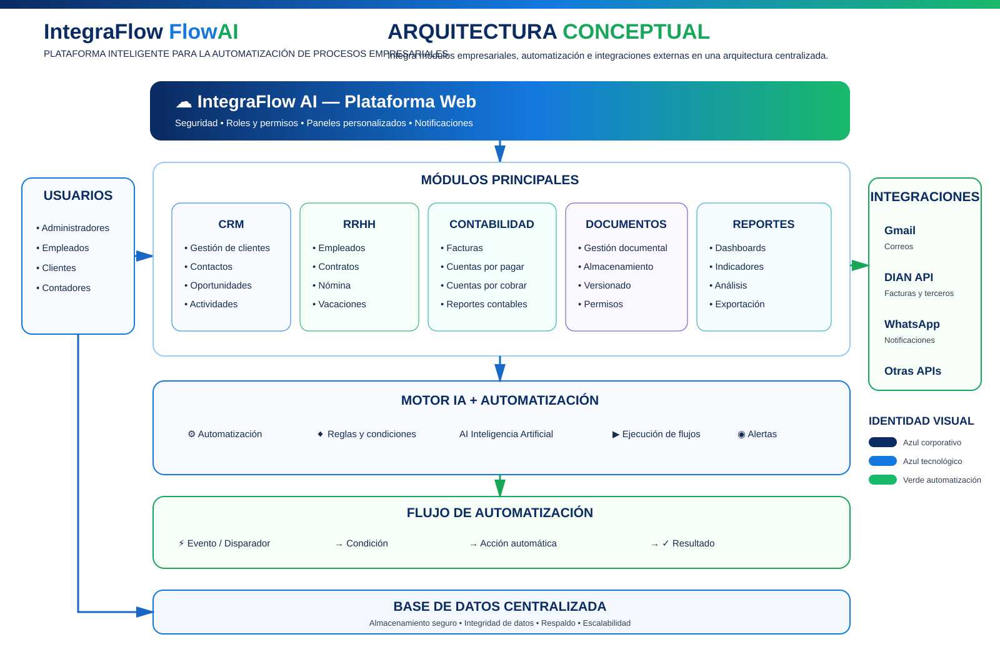

# IntegraFlow AI 🤖

> Plataforma web inteligente para la **automatización e integración de procesos empresariales mediante Inteligencia Artificial**.

## 🎯 Descripción

**IntegraFlow AI** es un proyecto orientado al desarrollo de una plataforma empresarial que busca centralizar información, automatizar tareas repetitivas y facilitar la gestión de procesos mediante herramientas digitales e Inteligencia Artificial.

El proyecto se desarrolla aplicando principios de **ingeniería de software, levantamiento de requisitos, historias de usuario y gestión ágil mediante GitHub**.

## 💡 Problema que busca resolver

Las organizaciones pueden gestionar información y procesos utilizando herramientas separadas, tareas manuales y diferentes canales de comunicación. Esto puede generar errores manuales, duplicidad de información, demoras y dificultades para consultar y analizar los datos.

IntegraFlow AI propone una plataforma centralizada para integrar estos procesos y facilitar su automatización.

## 🏗️ Arquitectura conceptual

<p align="center">
  
</p>

**Arquitectura conceptual de IntegraFlow AI.** La solución integra usuarios, módulos empresariales, un motor de IA y automatización, y servicios externos. Las integraciones externas representan componentes previstos de la solución y se implementarán progresivamente.

[Ver la arquitectura en tamaño completo](docs/arquitectura/README.md)

## 🚀 Módulos principales

| Módulo | Descripción |
|---|---|
| 👥 Usuarios y seguridad | Inicio de sesión, usuarios y control de acceso |
| 🤝 CRM | Gestión de clientes y relaciones comerciales |
| 👤 RRHH | Gestión de procesos relacionados con recursos humanos |
| 💰 Contabilidad | Apoyo a procesos contables y administrativos |
| 📄 Documentos | Carga, consulta, clasificación y gestión documental |
| ⚙️ IA + Automatización | Automatización de tareas y asistencia inteligente |
| 📊 Dashboard | Visualización de indicadores e información |
| 📑 Reportes | Generación y consulta de reportes |
| 🔗 Integraciones | Conexión prevista con Gmail, DIAN API y WhatsApp |

## 📋 Historias de usuario

Las historias de usuario se gestionan como Issues en GitHub:

- [HU-01 – Inicio de sesión](https://github.com/gmarin63/IntegraFlow-AI/issues/1)
- [HU-02 – Gestión de usuarios](https://github.com/gmarin63/IntegraFlow-AI/issues/2)
- [HU-03 – Gestión de clientes](https://github.com/gmarin63/IntegraFlow-AI/issues/3)
- [HU-04 – Gestión documental](https://github.com/gmarin63/IntegraFlow-AI/issues/4)
- [HU-05 – Automatización de procesos](https://github.com/gmarin63/IntegraFlow-AI/issues/5)
- [HU-06 – Dashboard de información](https://github.com/gmarin63/IntegraFlow-AI/issues/6)
- [HU-07 – Generación de reportes](https://github.com/gmarin63/IntegraFlow-AI/issues/7)
- [HU-08 – Asistencia mediante Inteligencia Artificial](https://github.com/gmarin63/IntegraFlow-AI/issues/8)

**Esfuerzo estimado:** 44 puntos.

## 📊 Levantamiento de información

Como parte del estudio inicial se aplicó una encuesta orientada a identificar el uso actual de software, problemas en procesos y oportunidades de automatización.

La muestra disponible para el análisis actual es de **19 respuestas**.

### Resultados destacados

| Indicador | Resultado |
|---|---:|
| Considera que los procesos pueden optimizarse mediante automatización | 16 de 19 (84,2 %) |
| Considera la automatización de tareas como funcionalidad principal | 12 de 19 (63,2 %) |
| Principal inconveniente: errores manuales | 8 de 19 (42,1 %) |
| Ingresa la misma información en diferentes aplicaciones frecuentemente o siempre | 8 de 19 (42,1 %) |
| Almacena documentación en la nube | 9 de 19 (47,4 %) |

Estos resultados respaldan la orientación del proyecto hacia la **automatización, integración de procesos y centralización de información**.

## 📚 Documentación del proyecto

La documentación se organizará progresivamente en `docs/` y estará alineada con las evidencias del proceso formativo:

- **GA1-220501092-AA3-EV01:** Diseño del instrumento de recolección de información.
- **GA1-220501092-AA3-EV02:** Formulación del proyecto de software.
- **GA1-220501092-AA3-EV03:** Formulario de recolección de información y análisis de resultados.
- **GA1-220501092-AA4-EV01:** Especificación de requisitos funcionales y no funcionales.
- **GA1-220501092-AA4-EV02:** Documento con especificación de requerimientos bajo IEEE 830 e historias de usuario.
- **GA1-220501092-AA5-EV01:** Determinación de especificaciones funcionales y metodología/herramienta para gestión de requisitos.
- **GA1-220501092-AA5-EV02:** Informe de evaluación de los requerimientos, prototipos y casos de prueba.

## 🗂️ Gestión del proyecto

La gestión actual utiliza:

- **GitHub Issues:** historias de usuario y seguimiento de trabajo.
- **GitHub Projects:** tablero para organizar el backlog y el flujo de trabajo.
- **GitHub Repository:** código fuente y documentación versionada.

Flujo previsto:

```text
Backlog → Por hacer → En progreso → En pruebas → Completado
```

## 🛠️ Tecnologías

El stack tecnológico definitivo se seleccionará durante el diseño técnico. El proyecto contempla:

- Aplicación web frontend.
- Backend y API.
- Base de datos.
- Automatización de procesos.
- Integración con servicios externos.
- Inteligencia Artificial.
- Visualización y análisis de información.

No se declaran tecnologías específicas como implementadas hasta que hayan sido configuradas y validadas en el repositorio.

## 📌 Roadmap

- [x] Definición inicial del proyecto.
- [x] Creación del repositorio.
- [x] Diseño del instrumento de encuesta.
- [x] Aplicación de encuesta y análisis inicial con 19 respuestas.
- [x] Definición de 8 historias de usuario.
- [x] Creación de HU-01 a HU-08 como Issues.
- [x] Arquitectura conceptual documentada.
- [x] Prototipos y casos de prueba definidos para la validación inicial.
- [ ] Configuración completa de GitHub Projects.
- [ ] Consolidación de requisitos funcionales y no funcionales.
- [ ] Diseño detallado de arquitectura.
- [ ] Diseño de base de datos.
- [ ] Implementación del backend.
- [ ] Implementación del frontend.
- [ ] Integración de servicios.
- [ ] Implementación del módulo de IA.
- [ ] Pruebas automatizadas.
- [ ] Despliegue de una versión MVP.

## 📂 Estructura prevista

```text
IntegraFlow-AI/
├── docs/
│   ├── requisitos/
│   ├── arquitectura/
│   └── evidencias-sena/
├── frontend/
├── backend/
├── database/
├── ai/
├── integrations/
├── tests/
├── .github/
└── README.md
```

La estructura se implementará progresivamente conforme avance el desarrollo.

## 🎓 Contexto académico

Este proyecto forma parte del proceso de formación en **Análisis y Desarrollo de Software (ADSO)** y aplica conocimientos de ingeniería de software, análisis de requisitos, automatización, datos e inteligencia artificial a un problema empresarial.

## 👤 Autor

**Gerardo Marín**  
Software Developer | AI & Automation | Data & Business Intelligence

- GitHub: [@gmarin63](https://github.com/gmarin63)

---

⭐ Proyecto académico en evolución.